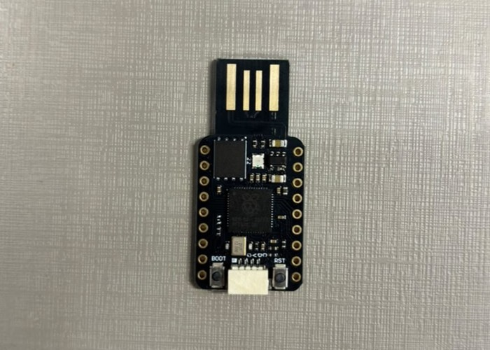

# RP2040 USB HID

A simple project using a RP2040-based development board configured as a USB Human Interface Device (HID).

When connected to a computer, the device is recognized as a USB keyboard and automatically opens Notepad before typing a predefined message.

## Warning

This project emulates a USB keyboard and automatically sends keystrokes when connected to a computer. Review the source code before flashing and connecting the device to ensure you understand the programmed behavior.

## Features
* USB HID keyboard emulation
* Automatic applications launch
* Automated text input
* RP2040 microcontroller implementation
  
## Hardware
* YANXD RP2040 MINI USB Development Board ([Recommended Link](https://pt.aliexpress.com/item/1005009725375348.html))


## SOFTWARE
* Arduino IDE

## Demonstration
After connecting the device:

1. The operating system recognizes the board as a USB keyboard.
2. Notepad (or other app of your choice) is opened automatically.
3. A predefined message is typed.

Example output:
"You were just hacked, lol."

## Setup

### Arduino IDE

1. Install the Arduino IDE.
2. Open **File → Preferences**.
3. Add the RP2040 boards package URL:

```text
https://github.com/earlephilhower/arduino-pico/releases/download/global/package_rp2040_index.json
```

4. Open **Tools → Board → Boards Manager**.
5. Search for **RP2040** and install the package by Earle F. Philhower.
6. Select your RP2040 board from **Tools → Board**.
7. Connect the board and upload the code.
8. You can edit the delay on the "delay(3000);", currently set to 3 seconds (that worked on slower computers that took sometime to even open notepad), to anytime you want.
9. You can edit the "Keyboard.println("notepad");" to open any program.
10. You can edit the "Keyboard.println("You were hacked, lol");" to type anything you wwish.

### Boot Mode
If the board is not detected by the Arduino IDE:

1. Disconnect the board from USB.
2. Press and hold the **BOOT** button.
3. While holding **BOOT**, connect the board to the computer.
4. Release the button after the board appears as a USB mass storage device.

The BOOT button forces the RP2040 into firmware upload mode, allowing new firmware to be flashed even if the current program is not functioning correctly.
The current code i am running also stops the program while to boot mode is up, so you dont have to deal with it when trying to configure.


## Educational Purpose
This project was created to learn:

* USB HID device development
* RP2040 programming
* Embedded systems fundamentals
* Computer input automation
